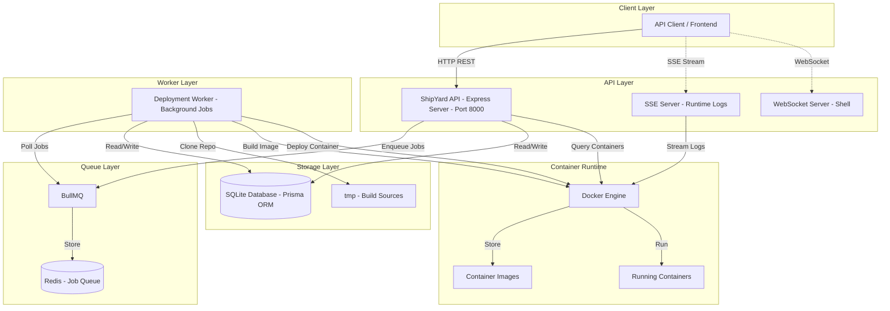
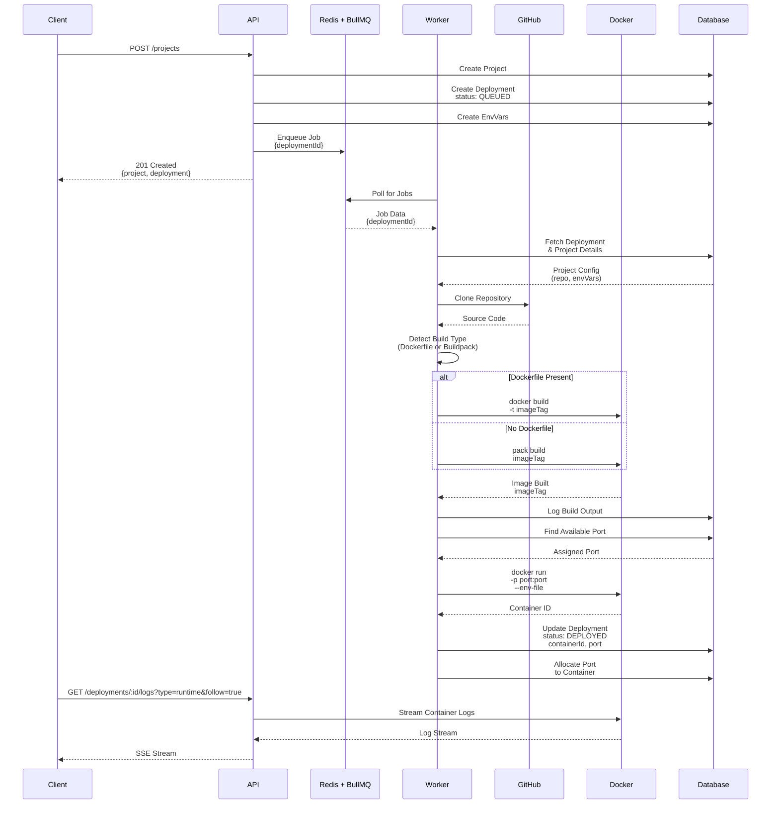
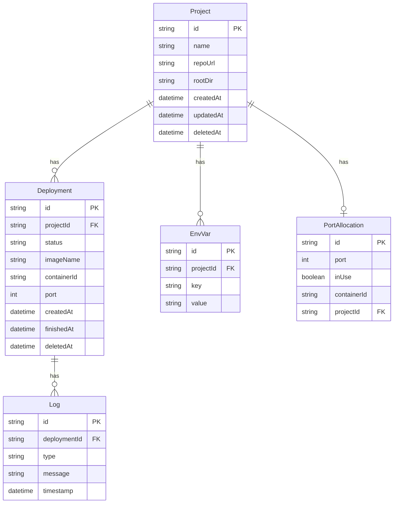

# ShipYard

A multi-tenant Platform-as-a-Service (PaaS) that enables teams and individual developers to build, deploy, and manage applications directly from GitHub repositories using a container-based deployment pipeline.

ShipYard provides deterministic builds, asynchronous job orchestration, and Docker-based runtime management with strong isolation between projects and deployments. The platform supports concurrent deployments across multiple projects and users, with a scalable architecture that grows from single-server deployments to distributed multi-node clusters.

## Why ShipYard?

Modern deployment workflows require complex orchestration between source control, build systems, container registries, and runtime environments. ShipYard consolidates these concerns into a unified platform designed for multi-tenant usage where isolation, repeatability, and scalability are first-class concerns.

- **Automates the deployment pipeline** from repository to running container
- **Provides build determinism** through containerized build environments
- **Ensures strong isolation** with separate containers and independent job execution
- **Scales horizontally** with stateless API design and parallel worker processing
- **Supports concurrent deployments** across multiple projects and teams
- **Maintains infrastructure control** while abstracting complexity

## System Architecture



## Deployment Workflow



## Database Schema



## Tech Stack

### Backend
- **Node.js** with TypeScript - Runtime and type safety
- **Express** - REST API framework
- **Prisma** - Type-safe ORM with SQLite
- **PostgreSQL** - Production database (migration path from SQLite)
- **BullMQ** - Reliable job queue system
- **Redis** - Job queue storage and caching
- **WebSocket (ws)** - Shell access to deployed containers
- **Zod** - Schema validation

### Build & Deployment
- **Docker** - Container runtime and build system
- **Dockerode** - Docker API client for Node.js
- **Cloud Native Buildpacks (pack CLI)** - Automated image builds for non-Dockerized applications
- **simple-git** - Git repository operations

### Infrastructure
- **Docker Compose** - Service orchestration
- **Winston** - Structured logging
- **Morgan** - HTTP request logging
- **Server-Sent Events (SSE)** - Real-time runtime log streaming

## Core Features

### Multi-Tenant Architecture
- Strong isolation between projects and deployments
- Concurrent deployment execution across multiple projects
- Containerized build environments for security and repeatability
- Dedicated runtime containers with isolated port allocation
- Shared infrastructure without shared application state

### Deployment Pipeline
- Clone applications from GitHub repositories
- Automatic build type detection (Dockerfile or Buildpacks)
- Containerized build execution with output logging
- Automated container deployment with restart policies
- Dynamic port allocation and management

### Application Management
- Project CRUD operations with environment variable support
- Deployment history and status tracking
- Container lifecycle controls (start, stop, restart, remove)
- Build log persistence
- Real-time runtime log streaming

### Background Processing
- Asynchronous job execution via BullMQ
- Automatic retry with exponential backoff
- Job status tracking and monitoring
- Graceful error handling and rollback

### API Features
- RESTful API design with Express
- Request validation using Zod schemas
- Structured logging with Winston
- Server-Sent Events (SSE) for real-time runtime log streaming
- WebSocket support for interactive shell access
- Comprehensive error handling

### Scalability & Architecture
- **Horizontal Scaling** - Stateless API design enables load balancing across multiple instances
- **Parallel Processing** - Multiple worker instances process deployments concurrently from shared queue
- **Independent Scaling** - API and worker processes scale separately based on demand
- **High-Cardinality Data** - Database schema optimized for deployment and log volume
- **Future-Ready** - Containerized runtime model supports migration to Kubernetes orchestration

## Getting Started

### Prerequisites
- Docker and Docker Compose
- Git
- Node.js 20+ (for development builds)

### Production Deployment (Docker Compose)

ShipYard is designed for production multi-tenant usage. The Docker Compose setup provides a complete deployment environment suitable for teams and organizations.

1. **Clone the repository**
```bash
git clone https://github.com/yourusername/shipyard.git
cd shipyard
```

2. **Configure environment variables**
```bash
# Create .env file
cat > .env << EOF
DATABASE_URL=file:/data/shipyard.db
REDIS_URL=redis://redis:6379
PORT=8000
DOCKER_SOCKET_PATH=/var/run/docker.sock
EOF
```

3. **Start the platform**
```bash
docker-compose up -d
```

This will start:
- **Redis** - Job queue on port 6379
- **ShipYard API** - REST API on port 8000
- **ShipYard Worker** - Background job processor

4. **Verify services**
```bash
docker-compose ps
curl http://localhost:8000/health
```

### Local Development Setup

1. **Install dependencies**
```bash
cd ShipYard-Api
npm install
```

2. **Configure environment**
```bash
# Create .env file for local development
cat > .env << EOF
DATABASE_URL=file:./dev.db
REDIS_URL=redis://127.0.0.1:6379
PORT=8000
DOCKER_SOCKET_PATH=//./pipe/docker_engine  # Windows
# DOCKER_SOCKET_PATH=/var/run/docker.sock  # Linux/Mac
EOF
```

3. **Start Redis (required)**
```bash
docker run -d -p 6379:6379 redis:alpine
```

4. **Run database migrations**
```bash
npx prisma migrate deploy
```

5. **Start API server**
```bash
npm run dev
# or for production build
npm run build
npm run start:api
```

6. **Start worker (in separate terminal)**
```bash
npm run start:worker
```

## API Reference

### Projects

#### Create Project
```http
POST /projects
Content-Type: application/json

{
  "name": "my-app",
  "repoUrl": "https://github.com/username/repo",
  "rootDir": "/",
  "envVars": [
    {"key": "NODE_ENV", "value": "production"}
  ]
}
```

#### List Projects
```http
GET /projects
```

#### Get Project
```http
GET /projects/:projectId
```

#### Update Project
```http
PUT /projects/:projectId
Content-Type: application/json

{
  "name": "updated-name",
  "envVars": [...]
}
```

#### Delete Project
```http
DELETE /projects/:projectId
```

### Deployments

Note: Deployments are automatically created when a project is created via `POST /projects`. The initial deployment is queued immediately.

#### List Deployments
```http
GET /deployments?projectId=uuid
```

#### Get Deployment
```http
GET /deployments/:deploymentId
```

#### Get Build Logs
```http
GET /deployments/:deploymentId/logs?type=build
```

#### Get Runtime Logs (Streaming)
```http
GET /deployments/:deploymentId/logs?type=runtime&follow=true
# Returns Server-Sent Events (SSE) stream for real-time logs
```

#### Get Runtime Logs (Static)
```http
GET /deployments/:deploymentId/logs?type=runtime&follow=false
```

#### Container Actions
```http
POST /deployments/:deploymentId/actions
Content-Type: application/json

{
  "action": "start" | "stop" | "restart" | "remove"
}
```

## Configuration

### Environment Variables

| Variable | Description | Default |
|----------|-------------|---------|
| `DATABASE_URL` | Prisma database connection string (SQLite or PostgreSQL) | `file:./shipyard.db` |
| `REDIS_URL` | Redis connection URL | `redis://127.0.0.1:6379` |
| `PORT` | API server port | `8000` |
| `DOCKER_SOCKET_PATH` | Docker daemon socket path | Platform-dependent |
| `DEPLOYMENT_QUEUE_RETRY_DELAY_MS` | Retry delay between failed jobs | `5000` |
| `DEPLOYMENT_QUEUE_MAX_RETRIES` | Maximum retry attempts | `3` |

**Production Note:** For multi-tenant production deployments, migrate from SQLite to PostgreSQL by updating the `DATABASE_URL` and running migrations.

### Port Allocation

ShipYard automatically allocates ports from the range **3000-9999** for deployed applications, ensuring isolation between projects in multi-tenant environments. The system:
- Tracks port usage in the database
- Assigns available ports sequentially
- Releases ports when containers are removed
- Prevents port conflicts across deployments and tenants

## Application Lifecycle

### Deployment States

| Status | Description |
|--------|-------------|
| `QUEUED` | Deployment job created and queued |
| `IN_PROGRESS` | Worker processing the deployment |
| `DEPLOYED` | Container running successfully |
| `FAILED` | Deployment failed (after retries) |

### Build Process

1. **Source Preparation**
   - Clone repository from GitHub
   - Navigate to specified root directory
   - Detect build type (Dockerfile vs Buildpack)

2. **Image Build**
   - Execute Docker build or Buildpack build
   - Tag image with `projectId:deploymentId-attempt`
   - Capture and persist build logs

3. **Container Deployment**
   - Allocate available port
   - Inject environment variables
   - Start container with restart policy
   - Update deployment status

4. **Cleanup**
   - Remove temporary source files
   - Handle rollback on failure

## Project Structure

```
ShipYard/
├── docker-compose.yml          # Production orchestration
├── data/                       # Persistent data volume
└── ShipYard-Api/
    ├── Dockerfile              # API + Worker image
    ├── prisma/
    │   └── schema.prisma       # Database schema
    ├── src/
    │   ├── config/             # Configuration management
    │   ├── constants/          # Application constants
    │   ├── db/                 # Prisma client
    │   ├── lib/                # Shared libraries
    │   │   ├── docker.ts       # Docker client
    │   │   ├── queue.ts        # BullMQ setup
    │   │   ├── redis.ts        # Redis client
    │   │   └── web-socket.ts   # WebSocket server
    │   ├── server/             # API server
    │   │   ├── controller/     # Request handlers
    │   │   ├── routes/         # API routes
    │   │   └── schema/         # Zod validation schemas
    │   ├── services/           # Business logic
    │   │   ├── build/          # Build detection & execution
    │   │   ├── deployment/     # Container management
    │   │   ├── port-allocation/# Port management
    │   │   └── source-manager/ # Git operations
    │   └── worker/             # Background job processor
    └── tmp/                    # Temporary build sources
```

## Roadmap

### Upcoming Features
- **Authentication & Authorization** - Multi-tenant user accounts, teams, and RBAC
- **Web Dashboard** - React-based UI for managing projects and deployments
- **Custom Domains** - Automatic SSL and reverse proxy configuration
- **GitHub Webhooks** - Automatic deployments on push
- **Multi-Container Applications** - Docker Compose support
- **Resource Limits** - CPU and memory constraints per container
- **Health Checks** - Automatic container health monitoring
- **Rollback Support** - One-click rollback to previous deployments
- **Build Cache** - Layer caching for faster builds
- **Private Repositories** - SSH key and token support
- **Usage Metrics** - Per-project resource tracking and quotas

### Infrastructure Enhancements
- **Load Balancing** - Built-in reverse proxy with automatic routing
- **Database Clustering** - PostgreSQL high-availability setup
- **Kubernetes Backend** - Replace Docker with K8s orchestration for massive scale
- **Multi-Region Support** - Geographic distribution of worker pools
- **Object Storage** - Build artifact storage (S3-compatible)
- **Metrics & Monitoring** - Prometheus and Grafana integration
- **Auto-Scaling** - Dynamic worker pool sizing based on queue depth

---

Built with Docker, Node.js, and TypeScript.
